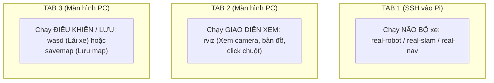

# 📖 BẢNG TRA CỨU TẤT CẢ CÁC LỆNH ĐIỀU KHIỂN ROBOT

> **Tài liệu tra cứu siêu tốc toàn bộ lệnh tắt trong hệ thống xe tự hành**  
> *Workspace:* `robot_ws` | *Hệ điều hành:* Ubuntu (ROS 2)

---

## 🧭 BẢNG TỔNG HỢP CÁC LỆNH (CHIA THEO NHÓM CHỨC NĂNG)

### 1. 🔧 Nhóm Lệnh Chung (Chạy trên cả PC & Pi)

| Lệnh tắt | Chạy ở đâu? | Chức năng chi tiết (1 câu) | Ví von dễ nhớ |
| :--- | :---: | :--- | :--- |
| **`build`** | Cả hai | Cập nhật và biên dịch lại toàn bộ code sau khi bạn chỉnh sửa. | *"Lưu & Nạp lại phần mềm"* |
| **`robot-help`** | Cả hai | In nhanh danh sách các phím tắt ra màn hình terminal để xem. | *"Xem Menu hướng dẫn"* |

---

### 2. 🔍 Nhóm Kiểm Tra Cảm Biến (Chạy trên Pi qua SSH)

| Lệnh tắt | Chạy ở đâu? | Chức năng chi tiết (1 câu) | Ví von dễ nhớ |
| :--- | :---: | :--- | :--- |
| **`test-lidar`** | **Pi (SSH)** | Bật riêng mắt quét LiDAR để kiểm tra xem laser có quay và đo khoảng cách không. | *"Khám mắt LiDAR"* |
| **`test-cam`** | **Pi (SSH)** | Bật riêng Camera để kiểm tra xem có thu được hình ảnh màu RGB và độ sâu không. | *"Khám mắt Camera"* |
| **`test-all`** | **Pi (SSH)** | Mở bảng báo cáo kiểm tra toàn bộ cảm biến (thấy hiện chữ **`[OK]`** là xe sẵn sàng chạy). | *"Khám sức khỏe tổng quát"* |

---

### 3. 🤖 Nhóm Vận Hành Robot Thật (Chạy trên Pi qua SSH)

| Lệnh tắt | Chạy ở đâu? | Chức năng chi tiết (1 câu) | Ví von dễ nhớ |
| :--- | :---: | :--- | :--- |
| **`real-robot`** | **Pi (SSH)** | Khởi động toàn bộ phần cứng (bật LiDAR + kết nối ESP32 + nổ máy xe chờ lệnh). | *"Nổ máy xe (chờ đạp ga)"* |
| **`real-slam`** | **Pi (SSH)** | Bật chế độ quét và vẽ bản đồ môi trường thực tế bằng LiDAR + Encoder. | *"Bật chế độ vẽ bản đồ"* |
| **`real-nav`** | **Pi (SSH)** | Bật hệ thống tự hành Nav2 để xe tự tính đường né vật cản chạy đến điểm click chuột. | *"Bật chế độ tự lái thông minh"* |

---

### 4. 💻 Nhóm Giao Diện & Điều Khiển (Chạy trên màn hình máy tính PC)

| Lệnh tắt | Chạy ở đâu? | Chức năng chi tiết (1 câu) | Ví von dễ nhớ |
| :--- | :---: | :--- | :--- |
| **`teleop`** / **`wasd`** | **PC** | Mở bàn phím **W-A-S-D** trên máy tính để bạn tự tay lái xe chạy đi dạo ngoài đời. | *"Vô-lăng / Tay cầm lái"* |
| **`rviz`** | **PC** | Mở màn hình đồ họa 3D xem Camera, tia Laser, bản đồ và **click chuột chỉ đường**. | *"Màn hình Taplo của xe"* |
| **`savemap <tên>`** | **PC/Pi** | Lưu bản đồ vừa quét xong vào thư mục `maps/` (ví dụ: `savemap map_vuon_bap`). | *"Bấm Ctrl + S lưu bản đồ"* |
| **`cancel`** | **PC/Pi** | Dừng xe và hủy mục tiêu dẫn đường Nav2 ngay lập tức khi gặp chướng ngại vật. | *"Nút Phanh khẩn cấp"* |

---

### 5. 🎮 Nhóm Mô Phỏng 3D (Chạy thử nghiệm trên PC - Không cần xe thật)

| Lệnh tắt | Chạy ở đâu? | Chức năng chi tiết (1 câu) | Ví von dễ nhớ |
| :--- | :---: | :--- | :--- |
| **`sim`** | **PC** | Mở thế giới 3D Gazebo ảo + xuất hiện chiếc xe tự hành trong vườn bắp. | *"Mở game mô phỏng"* |
| **`ai`** | **PC** | Bật AI Camera tự nhận diện hàng bắp và tự quay đầu $180^\circ$ trong mô phỏng. | *"Bật Auto tự lái trong game"* |
| **`slam`** | **PC** | Quét và dựng bản đồ thế giới ảo trong môi trường Gazebo. | *"Vẽ bản đồ trong game"* |
| **`nav`** | **PC** | Thử nghiệm thuật toán dẫn đường Nav2 tự né cây trong mô phỏng. | *"Dẫn đường trong game"* |

---

## 🎮 BẢNG PHÍM BẤM ĐIỀU KHIỂN XE BẰNG BÀN PHÍM (WASD)

*(Khi chạy lệnh `teleop` hoặc `wasd` trên máy tính PC)*

```text
       [W] : Tiến tới
 [A] : Trái     [D] : Phải
       [S] : Lùi lại

 [Q] : Tiến rẽ trái   |   [E] : Tiến rẽ phải
 [Z] : Lùi rẽ trái    |   [C] : Lùi rẽ phải

 [Space] hoặc [X]     : DỪNG XE KHẨN CẤP
 [+] hoặc [1]         : Tăng 10% tốc độ chạy
 [-] hoặc [2]         : Giảm 10% tốc độ chạy
 [Ctrl + C]           : Thoát chương trình lái
```

---

## 🖥️ MÔ HÌNH 3 TAB TERMINAL CHUẨN KHI VẬN HÀNH XE THẬT

Khi ngồi trước máy tính điều khiển xe ngoài vườn, bạn mở 3 Tab Terminal theo thứ tự sau:



1. **Tab 1 (SSH Pi):** `ssh vinh@<IP_Pi>` $\to$ `sudo chmod 666 /dev/ttyUSB*` $\to$ Chạy `real-slam` hoặc `real-nav`.
2. **Tab 2 (PC):** Chạy `rviz` $\to$ Quan sát xe và click chuột chỉ đường.
3. **Tab 3 (PC):** Chạy `wasd` $\to$ Dùng phím W-A-S-D lái xe, khi vẽ xong gõ `savemap <tên>`.
