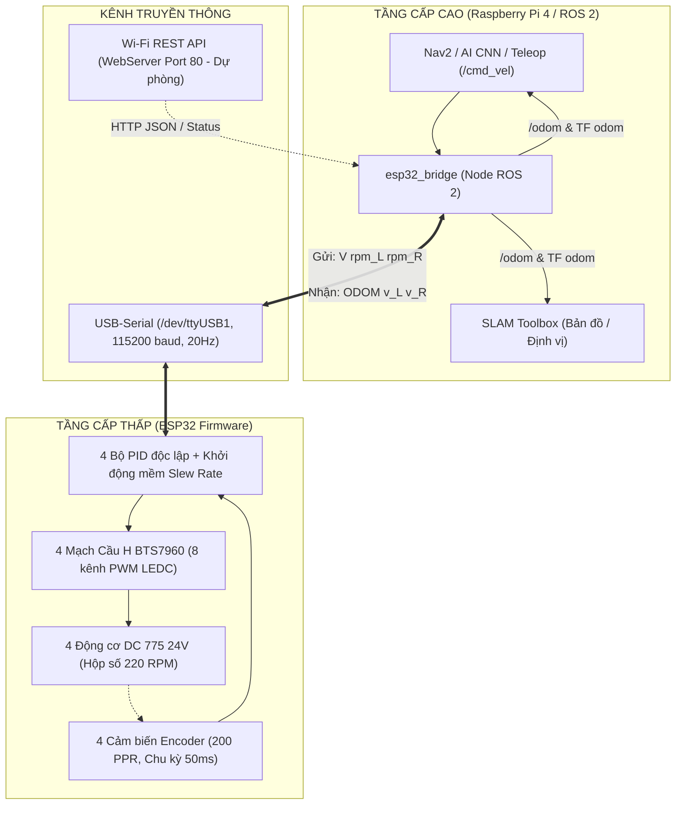
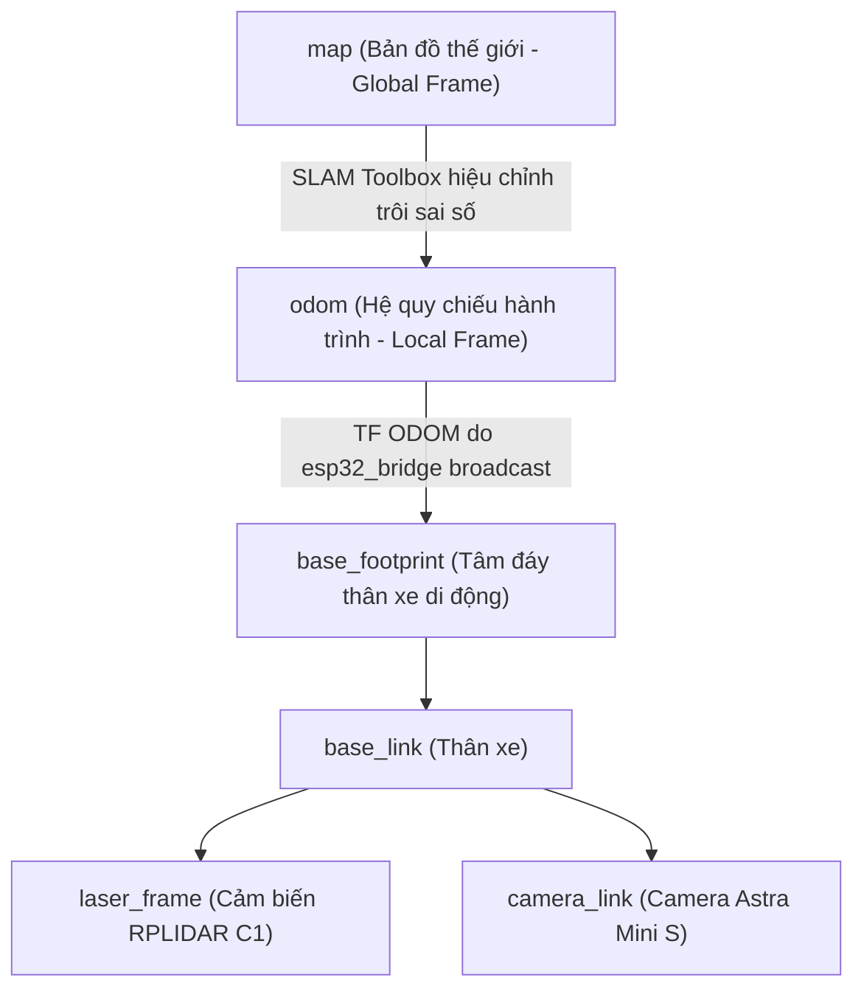

# 📘 TÀI LIỆU TỔNG HỢP: KIẾN TRÚC GIAO TIẾP RASPBERRY PI - ESP32 & HỆ THỐNG ODOMETRY (TF ODOM)

> **Tài liệu tham khảo kỹ thuật cho hệ thống xe tự hành ROS 2**  
> *Ngày lập:* 19/08/2026  
> *Workspace:* `robot_ws`  
> *Các file nguồn chính:*
> - Node cầu nối ROS 2: [`esp32_bridge.py`](file:///home/vinh/Màn hình nền/robot_ws/src/my_robot_bringup/my_robot_bringup/esp32_bridge.py)
> - Firmware điều khiển ESP32: [`codepid178.ino`](file:///home/vinh/Màn hình nền/robot_ws/src/esp32_source/codepid178.ino)
> - Launch khởi động xe thật: [`real_robot.launch.py`](file:///home/vinh/Màn hình nền/robot_ws/src/my_robot_bringup/launch/real_robot.launch.py)

---

## 🏗️ 1. Tổng Quan Kiến Trúc Phân Tầng

Hệ thống xe tự hành sử dụng mô hình điều khiển phân tầng chuẩn trong công nghiệp robot:



* **Raspberry Pi (Não bộ cấp cao):** Chạy hệ điều hành ROS 2, chịu trách nhiệm xử lý thuật toán nặng (AI CNN bám luống, xử lý tia LiDAR RPLIDAR C1, Camera Astra, thuật toán SLAM Toolbox vẽ bản đồ và Nav2 dẫn đường).
* **ESP32 (Bộ điều khiển cấp thấp thời gian thực):** Chịu trách nhiệm ngắt phần cứng tần số cao, đọc 4 encoder quang học, chạy 4 vòng lặp kín PID điều tốc và xuất xung PWM điều khiển 4 mạch cầu H BTS7960.

---

## 🔌 2. Kênh & Giao Thức Truyền Thông

| Đặc tính | Kênh chính (Serial) | Kênh phụ (Wi-Fi REST API) |
| :--- | :--- | :--- |
| **Giao thức** | UART Serial qua cáp USB | HTTP REST API qua Wi-Fi |
| **Cổng / Địa chỉ** | `/dev/ttyUSB1` (mặc định) | `http://<ESP32_IP>:80/` (mặc định `192.168.1.100`) |
| **Tốc độ / Chu kỳ** | `115200 bps`, chu kỳ gửi nhận `50ms` (**20 Hz**) | Bất đồng bộ (Polling theo nhu cầu) |
| **Mục đích sử dụng** | Truyền nhận liên tục thời gian thực trong lúc vận hành xe | Giám sát qua Web Dashboard, gỡ lỗi, cân chỉnh thông số PID |

---

## ⬇️ 3. Chi Tiết Chiều Xuống: Pi Gửi Gì Cho ESP32? (Downlink)

Khi các thuật toán cấp cao (Nav2, AI CNN hoặc bàn phím Teleop) phát lệnh di chuyển qua topic `/cmd_vel`:
* $v = \text{linear.x}$ (vận tốc dài, $\text{m/s}$)
* $\omega = \text{angular.z}$ (vận tốc góc, $\text{rad/s}$)

Node [`esp32_bridge`](file:///home/vinh/Màn hình nền/robot_ws/src/my_robot_bringup/my_robot_bringup/esp32_bridge.py) quy đổi động học vi sai bánh xe:
$$\text{Khoảng cách 2 vế bánh } (W) = 0.58\,\text{m}, \quad \text{Đường kính bánh } (D) = 0.20\,\text{m}$$
$$v_{\text{left}} = v - \frac{\omega \cdot W}{2}, \quad v_{\text{right}} = v + \frac{\omega \cdot W}{2}$$
$$\text{RPM}_{\text{left}} = \frac{v_{\text{left}} \times 60}{\pi \cdot D}, \quad \text{RPM}_{\text{right}} = \frac{v_{\text{right}} \times 60}{\pi \cdot D}$$

### 📡 Cú pháp gửi qua Serial:
```text
V <rpm_left> <rpm_right>\n
```
* **Ví dụ:**
  * `V 45.0 45.0\n` $\to$ Chạy thẳng tiến với tốc độ bánh ~45 RPM (~0.47 m/s).
  * `V -30.0 30.0\n` $\to$ Đánh lái xoay tại chỗ sang trái.
  * `V 0.0 0.0\n` $\to$ Dừng xe có hãm mềm (Slew Rate Limiter).

### 🌐 Cú pháp nếu điều khiển qua HTTP REST API:
* `GET /control?cmd=FORWARD&speed=180`
* `GET /pid?target_rpm_l=40&target_rpm_r=40&enabled=1`
* `GET /speed?value=200`
* `GET /turn_ratio?value=0.30`

---

## ⬆️ 4. Chi Tiết Chiều Lên: ESP32 Gửi Gì Cho Pi? (Uplink)

ESP32 đọc ngắt 4 bộ Encoder quang học (200 xung/vòng) theo chu kỳ `SPEED_CALC_INTERVAL_MS = 50ms`, tính toán vận tốc tức thời và gửi phản hồi lên Pi:

### 📡 1. Gói tin Odometry qua Serial (20 Hz):
```text
ODOM <v_left> <v_right>\n
```
* **Ý nghĩa:** `v_left`, `v_right` là vận tốc thực tế đo được của 2 bên xe (đơn vị $\text{m/s}$).
* **Xử lý trên Pi:** `esp32_bridge` đọc dữ liệu này để tính toán tọa độ Dead Reckoning, xuất bản topic `/odom` và broadcast TF `odom -> base_footprint`.

### 🛡️ 2. Gói tin Telemetry & Giám sát an toàn (Mỗi 500ms):
* **Trạng thái từng bánh:**
  `[W1] RPM:  45.2 | Speed: 0.473 m/s | Dist: 1.250 m | PWM_tgt:  180 | PID_tgt: 45 RPM | PID_pwm: 182`
* **Cảnh báo lỗi phần cứng:**
  * `[HEALTH] CANH BAO: Banh X bi KHOA!` $\to$ Bánh xe bị kẹt cơ khí / quá tải (PWM cao nhưng RPM < 8).
  * `[TREO]` $\to$ Bánh xe quay tự do (mất ma sát mặt đất).
  * `[MIRROR W3]` $\to$ Tính năng chịu lỗi (**Fault Tolerance**): Nếu encoder bánh 3 hỏng, firmware tự động bắt cầu đồng bộ theo bánh 2 để xe không bị mất lái.

### 🌐 3. Gói tin JSON qua HTTP (Polling API):
* **`GET /odometry`**:
  ```json
  {
    "wheel_left_rpm": 45.20,
    "wheel_right_rpm": 45.10,
    "wheel_left_speed": 0.4732,
    "wheel_right_speed": 0.4721,
    "wheel_left_distance": 1.2504,
    "wheel_right_distance": 1.2482,
    "pid_enabled": true
  }
  ```
* **`GET /encoders`**: Đọc chi tiết từng xung `count`, `rpm`, `distance_m` cả 4 bánh.
* **`GET /health`**: Trạng thái trượt/khóa của từng bánh xe.

---

## 🧭 5. Giải Thích Bản Chất: ODOM & TF Odom Là Gì?

### A. ODOM (Odometry - Đo đạc hành trình):
* **Bản chất:** Là phương pháp tính toán vị trí ước lượng của robot dựa vào quãng đường lăn của bánh xe (như công-tơ-mét kết hợp góc lái).
* **Công thức tích phân hành trình (Dead Reckoning):**
  Tại mỗi chu kỳ $\Delta t = 0.05\,\text{s}$:
  $$v_x = \frac{v_{\text{right}} + v_{\text{left}}}{2}, \quad \omega_z = \frac{v_{\text{right}} - v_{\text{left}}}{W}$$
  $$\Delta x = v_x \cdot \cos(\text{yaw}) \cdot \Delta t$$
  $$\Delta y = v_x \cdot \sin(\text{yaw}) \cdot \Delta t$$
  $$\Delta \text{yaw} = \omega_z \cdot \Delta t$$
  $$x \leftarrow x + \Delta x, \quad y \leftarrow y + \Delta y, \quad \text{yaw} \leftarrow \text{yaw} + \Delta \text{yaw}$$
* **Ý nghĩa:** Robot luôn biết: *"Tính từ lúc khởi động tại mốc $(0, 0, 0)$, mình đã đi được bao xa và đang xoay hướng nào"*.

---

### B. TF ODOM (`odom -> base_footprint`) Là Gì?
Trong ROS 2, **TF (Transform Frame System)** quản lý mối quan hệ không gian giữa các thành phần của robot.



* **`odom` frame:** Gốc tọa độ cố định gắn tại điểm xe bắt đầu bật nguồn.
* **`base_footprint` frame:** Tọa độ tâm đáy của thân xe (di chuyển liên tục theo robot).
* **TF ODOM:** Là phép biến đổi dịch chuyển $(x, y, z)$ và quay góc (Quaternion $q_z, q_w$) từ `odom` sang `base_footprint`. Nó nói cho toàn bộ các node ROS 2 biết vị trí tức thời của robot trong không gian.

---

## 🎯 6. Vai Trò Của ODOM & TF Odom Đối Với Hệ Thống

1. **Cho SLAM Toolbox (Quét & dựng bản đồ):**
   * Cảm biến LiDAR quay quét 360° liên tục. Khi xe di chuyển, nếu không có TF Odom báo xe đã đi được bao nhiêu centimet, các tia quét LiDAR sẽ bị chồng lấn lên nhau làm bản đồ bị méo mó.
   * SLAM dùng TF Odom làm giá trị dự đoán ban đầu (Initial Guess) rồi dùng thuật toán Scan Matching để khớp các tia LiDAR vào bản đồ chuẩn xác.
2. **Cho Nav2 (Dẫn đường tự động):**
   * Bộ điều khiển quỹ đạo (Local Controller / Pure Pursuit) cần biết vận tốc thực tế và vị trí cục bộ để tính toán gia tốc, bám vệt đường và tránh vật cản.
3. **Cho AI CNN & Quay đầu U-Turn:**
   * Giúp đo chính xác đoạn đường thoát hàng $2.5\,\text{m}$ sau khi hết luống bắp và quay tròn bán nguyệt $180^\circ$ đúng bán kính trước khi giao quyền lại cho camera nhận diện hàng mới.

---

## 📌 7. Bảng Tra Cứu Nhanh (Cheat Sheet)

| Tên thành phần | Loại | Nội dung / Cú pháp | Vai trò |
| :--- | :--- | :--- | :--- |
| **`cmd_vel`** | Topic ROS 2 | `geometry_msgs/msg/Twist` | Lệnh vận tốc ($v, \omega$) từ AI / Nav2 |
| **`V <rpm_L> <rpm_R>`** | Chuỗi Serial | `V 45.0 45.0\n` | Lệnh Pi gửi xuống ESP32 điều khiển motor |
| **`ODOM <v_L> <v_R>`** | Chuỗi Serial | `ODOM 0.473 0.472\n` | Dữ liệu vận tốc encoder ESP32 gửi lên Pi |
| **`/odom`** | Topic ROS 2 | `nav_msgs/msg/Odometry` | Dữ liệu vị trí $(x,y,\text{yaw})$ và vận tốc $(v_x, \omega_z)$ |
| **`odom -> base_footprint`** | TF Transform | Broadcast 20 Hz qua `tf2_ros` | Tọa độ thân xe so với điểm xuất phát ban đầu |
| **`[HEALTH]` / `[MIRROR]`** | Log Serial | `CANH BAO: Banh X bi KHOA!` | Cảnh báo kẹt bánh và kích hoạt cơ chế chịu lỗi |
