# 🚀 CẨM NANG VẬN HÀNH & BỘ LỆNH ĐIỀU KHIỂN XE TỰ HÀNH

> **Tài liệu quy trình chuẩn (SOP) dành cho xe tự hành thực tế**  
> *Workspace:* `robot_ws` | *Hệ điều hành:* Ubuntu (ROS 2 Jazzy / Humble)

---

## 🧭 LỘ TRÌNH VẬN HÀNH TỔNG QUAN

```mermaid
graph TD
    A["GIAI ĐOẠN 1: Cấu hình lần đầu duy nhất (Lắp xong xe)"] --> B["GIAI ĐOẠN 2: Thứ tự chuẩn bị BẮT BUỘC MỖI LẦN bật xe"]
    B --> C{"GIAI ĐOẠN 3: Chọn 1 trong 4 Chế Độ Tùy Chọn"}
    C -->|Tùy chọn 1| OPT1["🎮 Lái xe thủ công bằng bàn phím (Teleop)"]
    C -->|Tùy chọn 2| OPT2["🗺️ Quét & Lưu bản đồ mới (Real SLAM)"]
    C -->|Tùy chọn 3| OPT3["📍 Tự hành click chuột trên PC (Real Nav2)"]
    C -->|Tùy chọn 4| OPT4["🌽 Tự lái bám luống bằng Camera AI (CNN)"]
    OPT1 --> D["GIAI ĐOẠN 4: Quy trình tắt xe an toàn"]
    OPT2 --> D
    OPT3 --> D
    OPT4 --> D
```



---

## 🛠️ GIAI ĐOẠN 1: Làm 1 Lần Duy Nhất (Khi Vừa Lắp Xong Phần Cứng)

*(Chỉ cần thực hiện 1 lần đầu tiên sau khi ráp xe, các lần sau bỏ qua mục này)*

### 1. Cài đặt bộ lệnh tắt (Aliases) trên cả PC và Pi:
Mở terminal và chạy lệnh:
```bash
echo "source '$HOME/robot_ws/aliases.sh'" >> ~/.bashrc
source ~/.bashrc
```

### 2. Kê hổng 4 bánh xe khỏi mặt đất để kiểm tra chiều quay & Encoder:
* **Kiểm tra chiều quay Motor:** Mở Serial Monitor ESP32 (baud 115200), gửi lệnh: `FORWARD` (hoặc `V 30 30`).
  * *Chuẩn:* Cả 4 bánh phải quay **TIẾN** về phía trước. Nếu bánh nào quay ngược $\to$ Đổi 2 dây motor `M+` / `M-` của driver đó.
* **Kiểm tra chiều đếm Encoder:** Dùng tay xoay chậm bánh xe về phía trước.
  * *Chuẩn:* Tốc độ `Speed` và quãng đường `Dist` trên Serial **phải mang dấu DƯƠNG (+)**. Nếu mang dấu âm $\to$ Đảo 2 dây Pha A và Pha B của bánh đó.
* **Cân chỉnh đồng tốc 4 bánh:** Mở trình duyệt gõ `http://<IP_ESP32>/calibrate?pwm=150&duration=3000` để xe tự đo và cân bằng PID.

---

## ⚡ GIAI ĐOẠN 2: Thứ Tự BẮT BUỘC Làm MỖI LẦN Bật Xe Chạy

*(Mỗi khi đem xe ra chạy, bắt buộc làm tuần tự 4 bước này trước khi chọn chế độ lái)*

```
[BƯỚC 1: Bật nguồn 24V trên xe]
               │
               ▼
[BƯỚC 2: Mở sẵn 3 Tab Terminal trên máy tính PC]
               │
               ▼
[BƯỚC 3: Tab 1 (SSH vào Pi) -> Cấp quyền cổng USB]
               │
               ▼
[BƯỚC 4: Chạy test-all (5 giây) -> Xác nhận chữ xanh [OK]]
               │
               ▼
   ===> CHUYỂN SANG GIAI ĐOẠN 3 (CHỌN CHẾ ĐỘ) <===
```

### Chi tiết thao tác từng bước:

* **Bước 1:** Bật công tắc nguồn 24V trên xe (chờ 20 giây cho Pi và ESP32 khởi động xong).
* **Bước 2:** Trên máy tính (PC), mở sẵn **3 Tab Terminal** (`Ctrl + Shift + T`):
  * *Tab 1:* Dùng để điều khiển não bộ Pi.
  * *Tab 2:* Dùng để mở giao diện đồ họa RViz 2.
  * *Tab 3:* Dùng để lái xe bàn phím hoặc lưu bản đồ.
* **Bước 3 (Tại Tab 1):** SSH vào Pi và mở quyền truy cập cổng:
  ```bash
  ssh vinh@192.168.1.50   # Thay bằng IP thực tế của Pi
  sudo chmod 666 /dev/ttyUSB* /dev/video*
  ```
* **Bước 4 (Tại Tab 1):** Chạy kiểm tra nhanh toàn bộ cảm biến:
  ```bash
  test-all
  ```
  👉 **Quan sát màn hình:** Thấy Camera và LiDAR cùng báo chữ xanh **`[OK - HOẠT ĐỘNG]`** $\to$ Bấm **`Ctrl + C`** để dừng test. Xe đã sẵn sàng 100%!

---

## 🎯 GIAI ĐOẠN 3: TÙY CHỌN CHẾ ĐỘ CHẠY (Chọn 1 trong 4 mục)

---

### 🎮 TÙY CHỌN 1: Lái Xe Thủ Công Bằng Bàn Phím (Teleop)

*Dùng khi muốn điều khiển xe tự do đi dạo hoặc thử nghiệm động cơ.*

1. **Tab 1 (SSH Pi):** Khởi động toàn bộ phần cứng:
   ```bash
   real-robot
   ```
2. **Tab 2 (Terminal PC):** Mở màn hình quan sát (tùy chọn):
   ```bash
   rviz
   ```
3. **Tab 3 (Terminal PC):** Bật chế độ lái bàn phím WASD (hoặc gõ `wasd`):
   ```bash
   teleop
   ```
   * **Phím điều khiển chuẩn Gaming:**
     * **`W`** : Tiến tới | **`S`** : Lùi lại
     * **`A`** : Bẻ lái sang trái | **`D`** : Bẻ lái sang phải
     * **`Space`** hoặc **`X`** : DỪNG KHẨN CẤP
     * **`+`** / **`-`** (hoặc `1` / `2`) : Tăng / Giảm 10% tốc độ xe

---

### 🗺️ TÙY CHỌN 2: Quét Bản Đồ Khu Vườn Mới (Real SLAM)

*Dùng khi xe đến một khu vườn mới và cần vẽ bản đồ trước.*

1. **Tab 1 (SSH Pi):** Bật thuật toán SLAM quét bản đồ:
   ```bash
   real-slam
   ```
2. **Tab 2 (Terminal PC):** Mở màn hình xem bản đồ đang vẽ trực tiếp:
   ```bash
   rviz
   ```
3. **Tab 3 (Terminal PC):** Bật bàn phím lái xe:
   ```bash
   teleop
   ```
   *Lái xe chạy chậm quanh khu vườn cho đến khi thấy trên RViz bản đồ khép kín đường biên.*
4. **Lưu bản đồ (Tại Tab 3):** Nhấn `Ctrl + C` dừng teleop, sau đó gõ:
   ```bash
   savemap map_vuon_bap_lan_1
   ```
   *(File bản đồ `.yaml` và `.pgm` sẽ tự lưu vào thư mục `robot_ws/maps/`).*

---

### 📍 TÙY CHỌN 3: Tự Động Dẫn Đường Bằng Click Chuột Trên PC (Real Nav2)

*Dùng khi đã có bản đồ từ Tùy chọn 2 và muốn xe tự né vật cản chạy đến đích.*

1. **Tab 1 (SSH Pi):** Khởi động hệ thống tự hành Nav2:
   ```bash
   real-nav
   ```
   *(Hoặc nạp bản đồ cụ thể: `ros2 launch my_robot_bringup real_nav.launch.py map:=$HOME/robot_ws/maps/map_vuon_bap_lan_1.yaml`)*
2. **Tab 2 (Terminal PC):** Mở giao diện điều khiển:
   ```bash
   rviz
   ```
3. **Thao tác chuột trên màn hình RViz máy tính (2 click chuột):**
   * **Click 1 (Định vị xe):** Bấm phím **`P`** (nút `2D Pose Estimate`), click chuột vào vị trí xe đang đỗ thực tế và kéo mũi tên theo hướng đầu xe.
   * **Click 2 (Chỉ điểm đến):** Bấm phím **`G`** (nút `2D Goal Pose`), **click chuột vào bất kỳ chỗ nào trên bản đồ bạn muốn xe đi tới**.
4. **Kết quả:** Xe thật ngoài đời sẽ tự động tăng tốc, bẻ lái né các vật cản/người và chạy thẳng tới điểm bạn vừa click chuột.
5. **Hủy lệnh khẩn cấp:** Mở terminal gõ `cancel` hoặc bấm nút Cancel trên RViz.

---

### 🌽 TÙY CHỌN 4: Tự Lái Bám Luống Bắp Tự Động Bằng Camera AI (CNN)

*Dùng khi xe chạy trong luống cây nông nghiệp, tự nhận diện hàng cây và tự quay đầu U-Turn.*

1. **Tab 1 (SSH Pi):** Khởi động xe kèm tính năng AI:
   ```bash
   ros2 launch my_robot_bringup real_robot.launch.py enable_camera:=true enable_cnn:=true
   ```
2. **Tab 2 (Terminal PC):** Mở giao diện giám sát:
   ```bash
   rviz
   ```
3. **Hoạt động:** Camera AI sẽ tự động phân tích tâm luống bắp, tự xuất lệnh lái bám tim đường và tự phát hiện hết hàng để quay đầu $180^\circ$ sang luống tiếp theo.

---

## 🛑 GIAI ĐOẠN 4: Quy Trình Tắt Xe An Toàn

1. Trên các cửa sổ terminal (Tab 1, 2, 3), bấm **`Ctrl + C`** để dừng tất cả tiến trình.
2. Tắt hệ điều hành Raspberry Pi:
   ```bash
   sudo shutdown -h now
   ```
3. Chờ 15 giây cho đèn xanh trên Pi tắt hẳn $\to$ **Ngắt công tắc nguồn 24V chính / E-Stop**.

---

## 📋 PHỤ LỤC: BẢNG TRA CỨU ĐẤU DÂY PHẦN CỨNG NHANH

### 1. ESP32 $\leftrightarrow$ 4 Driver BTS7960:
*Nối chung chân **R_EN** và **L_EN** của cả 4 driver vào chân **3.3V/5V** trên ESP32.*
* **DRV1 (Trái Trước):** RPWM = **GPIO 47** | LPWM = **GPIO 4**
* **DRV2 (Trái Sau):** RPWM = **GPIO 45** | LPWM = **GPIO 18**
* **DRV3 (Phải Trước):** RPWM = **GPIO 13** | LPWM = **GPIO 15**
* **DRV4 (Phải Sau):** RPWM = **GPIO 20** | LPWM = **GPIO 21**

### 2. ESP32 $\leftrightarrow$ 4 Encoder (200 PPR):
* **ENC 1 (Trái Trước):** Pha A = **GPIO 16** | Pha B = **GPIO 17**
* **ENC 2 (Trái Sau):** Pha A = **GPIO 38** | Pha B = **GPIO 39**
* **ENC 3 (Phải Trước):** Pha A = **GPIO 10** | Pha B = **GPIO 11**
* **ENC 4 (Phải Sau):** Pha A = **GPIO 40** | Pha B = **GPIO 41**

### 3. Cổng USB trên Raspberry Pi:
* **LiDAR RPLIDAR C1:** Cắm cổng USB $\to$ `/dev/ttyUSB0` (460800 baud)
* **ESP32 Controller:** Cắm cổng USB $\to$ `/dev/ttyUSB1` (115200 baud)
* **USB Webcam:** Cắm cổng **USB 3.0 màu xanh** $\to$ `/dev/video0`
