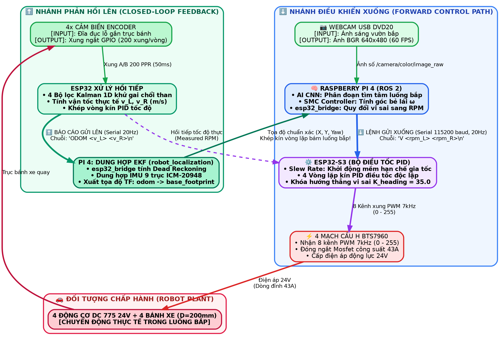
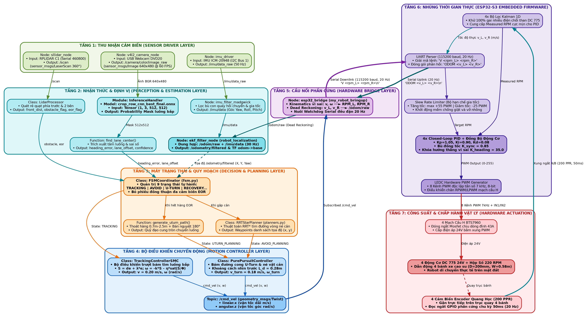
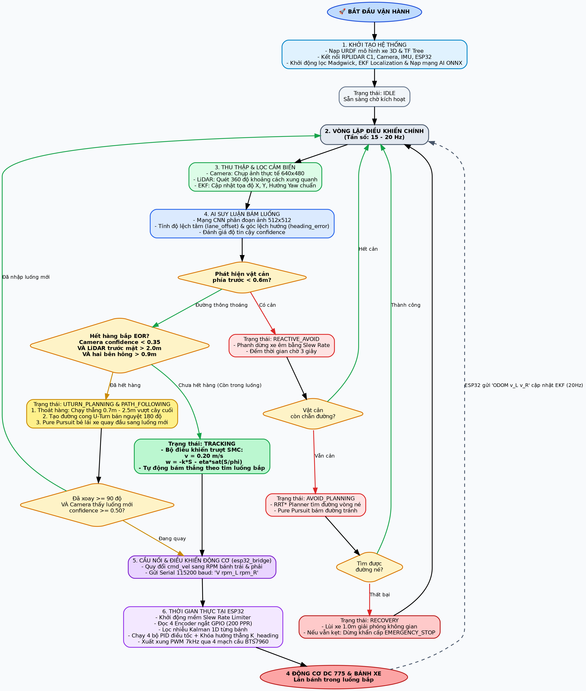
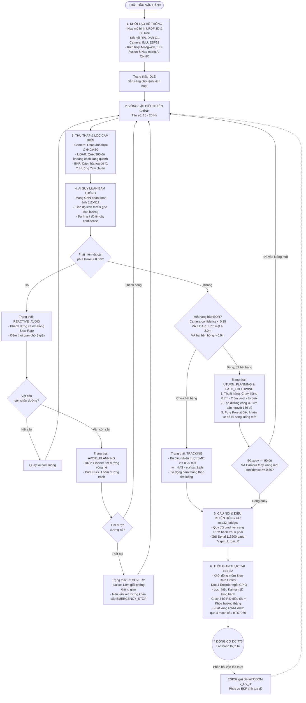
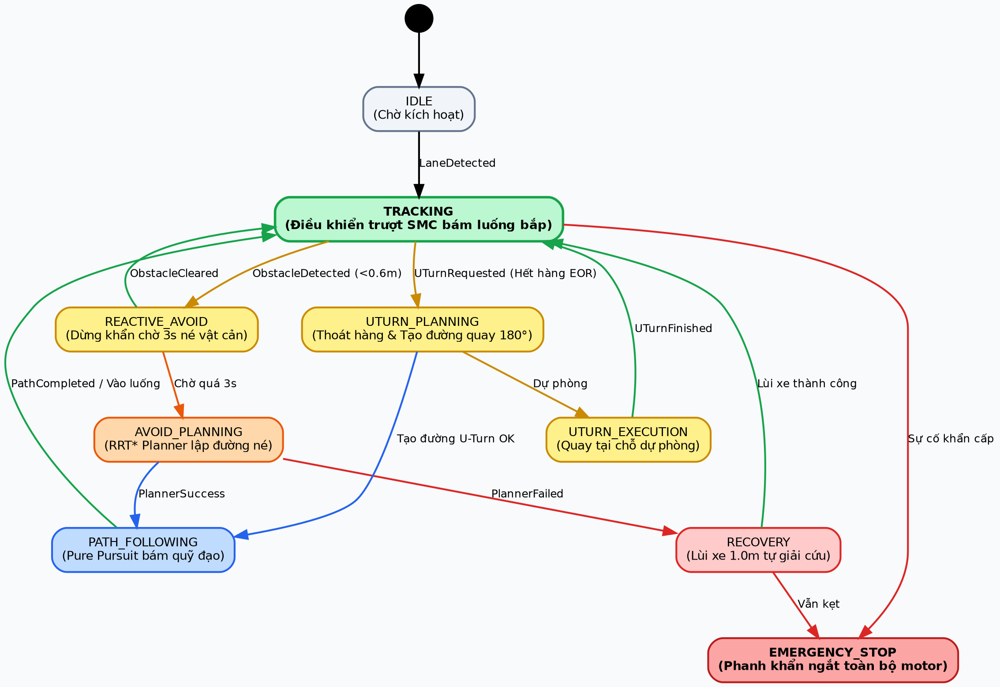
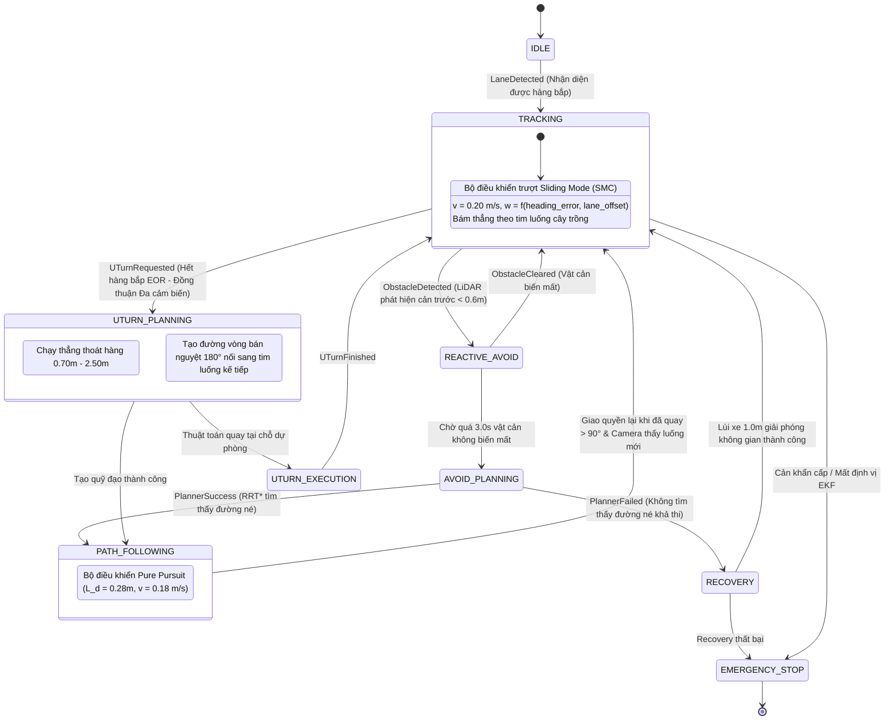
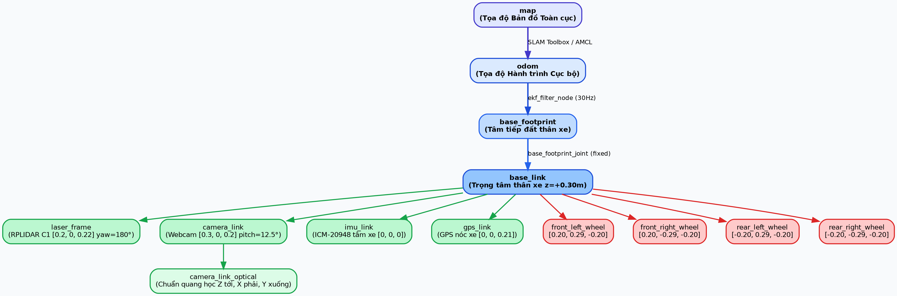

# 📘 TÀI LIỆU TỔNG HỢP: SƠ ĐỒ KHỐI VÀ QUY TRÌNH HOẠT ĐỘNG HỆ THỐNG XE TỰ HÀNH (LUANVAN ROBOT)

> **Tài liệu kỹ thuật phục vụ diễn thuyết, nghiên cứu và báo cáo khóa luận**  
> *Workspace:* `robot_ws`  
> *Robot Model:* `luanvan_robot` (Xe tự hành 4 bánh vi sai nông nghiệp)  
> *Bộ điều khiển:* Raspberry Pi 4 (ROS 2) kết hợp ESP32-S3 Firmware  

---

## 📑 MỤC LỤC
1. [Sơ Đồ Khối Luồng Dữ Liệu Chi Tiết (Input/Output & Signal Pipeline)](#1-sơ-đồ-khối-luồng-dữ-liệu-chi-tiết-inputoutput--signal-pipeline)
2. [Sơ Đồ Khối Kiến Trúc Lập Trình Chuẩn (Software Architecture Block Diagram)](#2-sơ-đồ-khối-kiến-trúc-lập-trình-chuẩn-software-architecture-block-diagram)
3. [Sơ Đồ Hoạt Động & Chu Trình Tự Hành (Operational Flowchart)](#3-sơ-đồ-hoạt-động--chu-trình-tự-hành-operational-flowchart)
4. [Sơ Đồ Máy Trạng Thái Hữu Hạn (FSM State Machine)](#4-sơ-đồ-máy-trạng-thái-hữu-hạn-fsm-state-machine)
5. [Sơ Đồ Cây Tọa Độ Không Gian (TF Coordinate Tree)](#5-sơ-đồ-cây-tọa-độ-không-gian-tf-coordinate-tree)
6. [Bảng Đặc Tả Chi Tiết Các Khối & Thông Số Kỹ Thuật](#6-bảng-đặc-tả-chi-tiết-các-khối--thông-số-kỹ-thuật)

---

## 1. Sơ Đồ Khối Luồng Dữ Liệu Chi Tiết (Input/Output & Signal Pipeline)



```text
============================================================================================================================
                     SƠ ĐỒ KHỐI HỆ THỐNG ĐIỀU KHIỂN VÒNG KÍN (CLOSED-LOOP CONTROL BLOCK DIAGRAM)
============================================================================================================================

 ┌─────────────────┐       ┌───────────────────────────────────────┐   ⬇️ LỆNH XUỐNG: "V <rpm_L> <rpm_R>\n"   ┌───────────────────────────────────┐
 │   WEBCAM USB    │─Ảnh──►│        RASPBERRY PI 4 (ROS 2)         │────────────────────────────────────────►│        ESP32-S3 FIRMWARE          │
 │  (DVD20 60 FPS) │       │  • AI CNN: Phân đoạn tìm tâm luống    │         (Serial USB 115200 baud)        │  • Slew Rate: Khởi động mềm       │
 └─────────────────┘       │  • SMC: Bộ điều khiển trượt tính góc  │                                         │  • 4x PID vòng kín điều tốc       │
                           │  • esp32_bridge: Quy đổi RPM vi sai   │                                         │  • Khóa hướng thẳng K_heading=35  │
                           └───────────────────▲───────────────────┘                                         └─────────────────┬─────────────────┘
                                               │                                                                               │
                                               │                                                                  Xung PWM 7kHz│ 8 Kênh (0 - 255)
                                               │                                                                               ▼
                                               │                                                             ┌───────────────────────────────────┐
                                               │                                                             │       4 MẠCH CẦU H BTS7960        │
                                               │                                                             │  • Đóng cắt Mosfet công suất 43A  │
                                               │                                                             │  • Cấp điện áp 24V băm xung       │
                                               │                                                             └─────────────────┬─────────────────┘
                                               │                                                                               │
                                               │                                                                    Điện áp 24V│ Động lực
                                               │                                                                               ▼
                                               │                                                             ┌───────────────────────────────────┐
                                               │                                                             │    4 ĐỘNG CƠ DC 775 24V (220 RPM) │
                                               │                                                             │    + 4 BÁNH XE CAO SU (D=200mm)   │
                                               │                                                             │    [XE CHẠY THỰC TẾ TRONG LUỐNG]  │
                                               │                                                             └─────────────────┬─────────────────┘
                                               │                                                                               │
                                               │                                                                     Trục quay │ bánh xe
                                               │                                                                               ▼
                                               │ ⬆️ BÁO CÁO LÊN: "ODOM <v_L> <v_R>\n"                        ┌───────────────────────────────────┐
                                               │    (Serial 20Hz - Phản hồi vận tốc thực)                    │        4x CẢM BIẾN ENCODER        │
                                               │                                                             │  • Đĩa đục lỗ 200 xung/vòng (PPR) │
                                               │                                                             │  • Đọc ngắt GPIO mỗi 50ms (20Hz)  │
                                               │                                                             └─────────────────┬─────────────────┘
                                               │                                                                               │
                                               │                                                                  Xung ngắt A/B│ 200 PPR
                                               │                                                                               ▼
                           ┌───────────────────┴───────────────────┐   Vận tốc thực v_L, v_R (m/s)   ┌───────────────────────────────────┐
                           │      DUNG HỢP EKF TRÊN PI 4           │◄────────────────────────────────│     4 BỘ LỌC KALMAN 1D TRÊN ESP32 │
                           │  • Dead Reckoning tính tọa độ xe      │   (Sau khi lọc nhiễu chổi than) │  • Khử 100% gai nhiễu điện chổi than│
                           │  • Dung hợp với IMU 9 trục ICM-20948  │                                 │  • Khép vòng kín PID tốc độ ở ESP32│
                           │  • Xuất TF chuẩn: odom -> base        │                                 └─────────────────┬─────────────────┘
                           └───────────────────┬───────────────────┘                                                   │
                                               │                                                                       │ Vòng lặp PID trong
                                               └─────── 🔄 VÒNG ĐIỀU KHIỂN BÁM LUỐNG KHÉP KÍN ────────────────────────┘ (So sánh Measured RPM)

============================================================================================================================
```

### 📋 Bảng Tóm Tắt Input - Xử Lý - Output & File Mã Nguồn

| Khối | Input | Xử Lý | Output | File Code Chịu Trách Nhiệm |
| :--- | :--- | :--- | :--- | :--- |
| **1. Webcam USB** | Quang cảnh bắp | Cảm biến CMOS (1080p @ 60 FPS) | Ảnh `640x480` / `1080p` (`/camera/color/image_raw`) | [`real_robot.launch.py`](file:///home/vinh/Màn hình nền/robot_ws/src/my_robot_bringup/launch/real_robot.launch.py) |
| **2. AI CNN** | Ảnh `640x480` | Mạng ONNX trích xuất tâm luống | `heading_error`, `lane_offset` | [`inference_handler.py`](file:///home/vinh/Màn hình nền/robot_ws/src/my_robot_controller/my_robot_controller/inference_handler.py) |
| **3. Điều Khiển Bám Luống** | Sai số góc & tâm | Bộ điều khiển trượt SMC | Topic `/cmd_vel` ($v=0.30\text{m/s}, \omega=0.60\text{rad/s}$) | [`controllers.py`](file:///home/vinh/Màn hình nền/robot_ws/src/my_robot_controller/my_robot_controller/controllers.py) |
| **4. Cầu Nối Động Học** | Topic `/cmd_vel` | Quy đổi động học vi sai | Chuỗi Serial: `V <rpm_L> <rpm_R>\n` | [`esp32_bridge.py`](file:///home/vinh/Màn hình nền/robot_ws/src/my_robot_bringup/my_robot_bringup/esp32_bridge.py) |
| **5. Vi Điều Khiển ESP32** | `V rpm_L rpm_R\n` | Slew Rate + 4x PID + Kalman 1D | 8 Kênh PWM 7kHz tới BTS7960 | [`code0409.ino`](file:///home/vinh/Màn hình nền/robot_ws/src/esp32_source/code0409.ino) |
| **6. Phần Cứng Động Cơ** | Xung PWM 24V | Động cơ 775 + Hộp số giảm tốc | Truyền động 4 bánh độc lập | 4x Mạch BTS7960 H-Bridge |
| **7. Phản Hồi Encoder** | Bánh xe quay | Đếm xung 200 PPR $\to$ Kalman 1D | Chuỗi Serial lên Pi: `ODOM <v_L> <v_R>\n` | [`code0409.ino`](file:///home/vinh/Màn hình nền/robot_ws/src/esp32_source/code0409.ino) |
| **8. Dung Hợp EKF** | `ODOM v_L v_R` + IMU | Dung hợp EKF $\to$ Dead Reckoning | Tọa độ chuẩn TF: `odom -> base_footprint` | [`ekf.yaml`](file:///home/vinh/Màn hình nền/robot_ws/src/my_robot_bringup/config/ekf.yaml) |

---

## 2. Sơ Đồ Khối Kiến Trúc Lập Trình Chuẩn (Software Architecture Block Diagram)



> **Cấu trúc 7 Tầng Lập Trình Chuẩn:**
> - **Tầng 1 (Sensor Driver):** `v4l2_camera_node` (Webcam DVD20 60 FPS, FOV 78°), `sllidar_node` (RPLIDAR C1 360°), `imu_driver` (50 Hz).
> - **Tầng 2 (Perception & Estimation):** `InferenceHandler` (ONNX 512x512), `find_lane_center()`, `LidarProcessor`, `imu_filter_madgwick`, `ekf_filter_node` (30 Hz).
> - **Tầng 3 (Decision & Planning):** `FSMCoordinator` (9 trạng thái tự hành), `generate_uturn_path()`, `RRTStarPlanner`.
> - **Tầng 4 (Motion Control):** `TrackingControllerSMC` (bám luống v=0.30 m/s, bẻ lái gấp đôi w=0.60 rad/s), `PurePursuitController` (quay đầu & né cản) ➔ `/cmd_vel`.
> - **Tầng 5 (Hardware Bridge):** `esp32_bridge` (Động học vi sai $v, \omega \leftrightarrow \text{RPM}$, Watchdog 20 Hz).
> - **Tầng 6 (Real-Time Firmware ESP32):** UART Parser, Slew Rate Limiter, 4x Closed-Loop PID + Khóa hướng $K_{\text{heading}}=35$, 4x Kalman 1D, LEDC PWM 7kHz.
> - **Tầng 7 (Hardware Actuation):** 4 Mạch BTS7960, 4 Động cơ DC 775 24V, 4 Encoder 200 PPR (Ngắt GPIO 20 Hz).

---


## 3. Sơ Đồ Hoạt Động & Chu Trình Tự Hành (Operational Flowchart)



<details>
<summary><b>🔍 Bấm vào đây để xem mã nguồn Mermaid của Chu Trình Vận Hành</b></summary>



</details>

---

## 4. Sơ Đồ Máy Trạng Thái Hữu Hạn (FSM State Machine)



<details>
<summary><b>🔍 Bấm vào đây để xem mã nguồn Mermaid của FSM</b></summary>



</details>

---

## 5. Sơ Đồ Cây Tọa Độ Không Gian (TF Coordinate Tree)



<details>
<summary><b>🔍 Bấm vào đây để xem mã nguồn Mermaid của Cây TF</b></summary>

```mermaid
graph TD
    map["map (Tọa độ Bản đồ Toàn cục - Global)"]
    odom["odom (Tọa độ Hành trình Cục bộ - Local)"]
    base_footprint["base_footprint (Tâm tiếp xúc mặt đất của thân xe)"]
    base_link["base_link (Trọng tâm thân xe z = +0.30m)"]
    laser_frame["laser_frame (RPLIDAR C1 [0.2, 0, 0.22], xoay 180°)"]
    camera_link["camera_link (Webcam [0.3, 0, 0.2], pitch = 12.5°)"]
    camera_link_optical["camera_link_optical (Trục quang học: Z nhìn tới, X sang phải, Y hướng xuống)"]
    imu_link["imu_link (ICM-20948 tại tâm khung gầm [0, 0, 0])"]
    gps_link["gps_link (Mô-đun GPS nóc xe [0, 0, 0.21])"]
    
    FL_wheel["front_left_wheel [0.20, 0.29, -0.20]"]
    FR_wheel["front_right_wheel [0.20, -0.29, -0.20]"]
    RL_wheel["rear_left_wheel [-0.20, 0.29, -0.20]"]
    RR_wheel["rear_right_wheel [-0.20, -0.29, -0.20]"]

    map -->|SLAM Toolbox / AMCL broadcast| odom
    odom -->|ekf_filter_node (robot_localization) broadcast 30Hz| base_footprint
    base_footprint -->|base_footprint_joint (fixed)| base_link
    base_link --> laser_frame
    base_link --> camera_link
    camera_link --> camera_link_optical
    base_link --> imu_link
    base_link --> gps_link
    base_link --> FL_wheel
    base_link --> FR_wheel
    base_link --> RL_wheel
    base_link --> RR_wheel
```

</details>

---

## 6. Bảng Đặc Tả Chi Tiết Các Khối & Thông Số Kỹ Thuật

| Khối Chức Năng | Thành Phần Phần Cứng / Node Phần Mềm | Giao Thức / Thông Số Hoạt Động | Chức Năng Cốt Lõi |
| :--- | :--- | :--- | :--- |
| **Khối Cảm Biến** | RPLIDAR C1 | Serial UART (`/dev/rplidar`, 460800 baud) | Quét Laser mặt phẳng 360°, tầm xa 12m, tần số 10-12 Hz |
| | Webcam USB DVD20 | V4L2 MJPG (`/dev/video0`, 1080p/VGA @ 60 FPS) | Cung cấp luồng hình ảnh thị giác máy tính cho AI |
| | IMU ICM-20948 | I2C Bus 1 (Địa chỉ `0x68`, Rate 50 Hz) | Đo vận tốc góc (Gyro) và gia tốc tuyến tính (Accel) 9 trục |
| | 4x Encoder quang | Ngắt GPIO ESP32 (Độ phân giải 200 PPR) | Đo vận tốc quay tức thời từng bánh xe |
| **Khối Não Bộ (Pi 4)** | `crop_row_cnn_best_final.onnx` | ONNX Runtime (Tensor 512x512) | Phân đoạn hàng bắp, tính sai số góc hướng và độ lệch tâm |
| | `imu_filter_madgwick` | ROS 2 Node (50 Hz) | Lọc bù định hướng AHRS, triệt tiêu trôi dạt góc Yaw |
| | `ekf_node` (`robot_localization`)| ROS 2 Node (30 Hz) | Dung hợp `/odom/raw` và `/imu/data` broadcast TF `odom -> base_footprint` |
| | `TrackingControllerSMC` | Sliding Mode Control ($\lambda=2.0, k=3.5, \eta=0.6$) | Khử sai số bám thẳng tim luống bắp với tốc độ $0.20\text{ m/s}$ |
| | `PurePursuitController` | Pure Pursuit ($L_d=0.28\text{m}, v=0.18\text{ m/s}$) | Bám quỹ đạo đường cong bán nguyệt quay đầu U-Turn 180° |
| | `esp32_bridge` | ROS 2 Node $\leftrightarrow$ Serial UART 115200 baud | Quy đổi động học vi sai bánh xe, phát nuôi Watchdog 20 Hz |
| **Khối Điều Khiển (ESP32)** | 4 Bộ lọc Kalman 1D | Thuật toán rời rạc thời gian thực ($Q=0.10, R=6.0$) | Lọc nhiễu chổi than 775, triệt tiêu gai xung ảo của Encoder |
| | 4 Bộ điều tốc PID độc lập | Vòng kín tốc độ ($K_p=1.05, K_i=0.90, K_d=0.08$) | Duy trì chính xác RPM từng bánh dù gặp tải nặng hay dốc |
| | Khóa hướng $K_{\text{heading}}$ | Bù vi sai góc lái ($K=35.0$) | Khóa chặt hướng thẳng, chống xẹo xe khi trượt bánh |
| | Slew Rate Limiter | Gia tốc PWM động ($\text{Step}_{\max}=12, \text{Deadzone}=28$) | Khởi động mềm êm ái, bảo vệ nhông hộp số không bị giật |
| **Khối Công Suất** | 4 Mạch cầu H BTS7960 | Điều chế độ rộng xung PWM 7 kHz (8-bit: 0-255) | Đóng cắt công suất tải dòng đỉnh lên đến 43A |
| | 4 Động cơ DC 775 24V | Tỉ số truyền hộp số: 220 RPM tại 24V | Cung cấp lực kéo mô-men xoắn lớn cho 4 bánh xe cao su |
| **Khối Nguồn** | Pin Li-ion / Ắc quy 24V | Nguồn tổng xả dòng cao | Cấp trực tiếp 24V cho động cơ qua 4 mạch cầu H |
| | 2x Mạch Buck DC-DC | 24V $\to$ 5V (5A cho Pi 4, 3A cho ESP32) | Cách ly nguồn điều khiển với nguồn công suất, chống sụt áp |
| **Khối Giám Sát (PC)** | RViz 2 & Teleop WASD | CycloneDDS mạng LAN Wi-Fi (Domain ID: `0`) | Quan sát bản đồ SLAM, ảnh Camera và can thiệp lái khẩn cấp |
