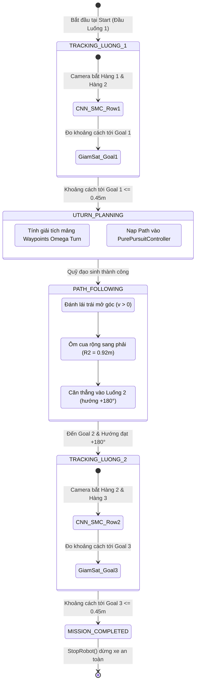

# 📘 TÀI LIỆU KỸ THUẬT: Ý TƯỞNG & PHƯƠNG ÁN THỰC THI QUAY ĐẦU OMEGA TURN KẾT HỢP GPS CHO XE TỰ HÀNH NÔNG NGHIỆP

> **Tài liệu độc lập phục vụ nghiên cứu, phân tích và chuẩn bị thực nghiệm**  
> *Đặc thù ruộng thực tế:* 3 hàng cây bắp song song — 2 luống chạy vi sai.  
> *Mục tiêu kỹ thuật:* Quay đầu chuyển sang luống bên phải (+180°), chống trượt bánh trên đất/cỏ, không xoay tại chỗ, **TUYỆT ĐỐI KHÔNG SỬA ĐỔI LOGIC BÁM HÀNG (CNN + SMC) HIỆN TẠI**.

---

## 📑 MỤC LỤC
1. [Bản Chất Thực Địa Ruộng Bắp: 2 Luống Có 3 Hàng Cây](#1-bản-chất-thực-địa-ruộng-bắp-2-luống-có-3-hàng-cây)
2. [Đính Chính Chiều Quay & Bản Chất Góc Đảo Hướng (+180°)](#2-đính-chính-chiều-quay--bản-chất-góc-đảo-hướng-180)
3. [Phân Tích Hiện Trạng Mã Nguồn & Lý Do U-Turn Cũ Bị Thất Bại](#3-phân-tích-hiện-trạng-mã-nguồn--lý-do-u-turn-cũ-bị-thất-bại)
4. [Mô Tả Chi Tiết Ý Tưởng Điều Phối 4 Điểm Mốc](#4-mô-tả-chi-tiết-ý-tưởng-điều-phối-4-điểm-mốc)
5. [Mô Hình Toán Học Quỹ Đạo Omega Turn (Tránh Trượt Bánh)](#5-mô-hình-toán-học-quỹ-đạo-omega-turn-tránh-trượt-bánh)
6. [Thiết Kế Kiến Trúc FSM & Nguyên Tắc Bảo Toàn Khối Bám Hàng](#6-thiết-kế-kiến-trúc-fsm--nguyên-tắc-bảo-toàn-khối-bám-hàng)
7. [Phương Án Quản Lý Tọa Độ GPS & Metric Odom (Đề Xuất YAML)](#7-phương-án-quản-lý-tọa-độ-gps--metric-odom-đề-xuất-yaml)
8. [Quy Trình Triển Khai Sau Này Khi Bạn Đồng Ý Chỉnh Code](#8-quy-trình-triển-khai-sau-này-khi-bạn-đồng-ý-chỉnh-code)

---

## 1. Bản Chất Thực Địa Ruộng Bắp: 2 Luống Có 3 Hàng Cây

Trong canh tác bắp thực tế của đề tài:
* Có **3 hàng cây bắp** trồng thẳng hàng và song song:
  * **Hàng cây 1** (bên trái ngoài cùng).
  * **Hàng cây 2** (hàng cây ở giữa — ranh giới chung giữa 2 luống).
  * **Hàng cây 3** (bên phải ngoài cùng).
* Khoảng trống giữa 3 hàng cây tạo thành **2 luống chạy (2 làn đi / 2 rãnh rùa)**:
  * **Luống 1 (Làn 1)**: Nằm giữa Hàng cây 1 và Hàng cây 2.
  * **Luống 2 (Làn 2)**: Nằm giữa Hàng cây 2 và Hàng cây 3.
* Khoảng cách từ tâm Luống 1 sang tâm Luống 2 là $w = \text{row\_spacing} = 1.20\,\text{m}$.

```text
========================================================================================
                              SƠ ĐỒ RUỘNG BẮP THỰC TẾ
========================================================================================

  [HÀNG CÂY 1]        🌱 ─── 🌱 ─── 🌱 ─── 🌱 ─── 🌱 ─── 🌱 ─── 🌱 ─── 🌱
                        │                                             ▲
                     [LUỐNG 1]                                     [LUỐNG 2]
                   (Xe chạy đi)                                 (Xe chạy về +180°)
                        ▼                                             │
  [HÀNG CÂY 2]        🌽 ─── 🌽 ─── 🌽 ─── 🌽 ─── 🌽 ─── 🌽 ─── 🌽 ─── 🌽  (HÀNG CHUNG Ở GIỮA)
                        │                                             ▲
                     [LUỐNG 1]                                     [LUỐNG 2]
                        │                                             │
                        ▼                                             │
  [HÀNG CÂY 3]        🌾 ─── 🌾 ─── 🌾 ─── 🌾 ─── 🌾 ─── 🌾 ─── 🌾 ─── 🌾
```

---

## 2. Đính Chính Chiều Quay & Bản Chất Góc Đảo Hướng (+180°)

### 2.1. Đảo chiều hướng đầu xe +180°
* Khi xe chạy dọc Luống 1, hướng ban đầu là $\theta_1$ (ví dụ $\theta_1 = 0^\circ$).
* Khi xe đến cuối Luống 1 và cần chuyển sang Luống 2 ở bên phải để chạy ngược chiều lại, **hướng đầu xe mục tiêu phải đảo ngược $180^\circ$**:
  $$\theta_2 = \theta_1 + 180^\circ$$

### 2.2. Tại sao tuyệt đối KHÔNG xoay tại chỗ và KHÔNG bo cua gấp sang phải?
* Xe sử dụng hệ truyền động **4 bánh vi sai (skid-steer 4WD)** với bề rộng xe $b = 0.58\,\text{m}$ trên nền đất/cỏ.
* Nếu xe đứng xoay tại chỗ (spin in place / $v = 0$): 2 bánh trái tiến, 2 bánh phải lùi $\rightarrow$ bánh xe cày lún đất ruộng, trượt ngang và làm sai lệch toàn bộ góc Yaw của IMU/Odometry.
* Nếu xe bo cua chữ U trực tiếp sang phải: Do khoảng cách giữa 2 tâm luống chỉ có $w = 1.20\,\text{m}$, bán kính quay chỉ là $R = w / 2 = 0.60\,\text{m}$. Bán kính $0.60\,\text{m}$ đối với thân xe $0.58\,\text{m}$ là quá gắt, bánh xe phía trong cua gần như bị ghìm đứng, bánh ngoài trượt lê làm kẹt xe.
* **Quy luật hình học bắt buộc**: Xe phải **đánh lái uốn cong sang trái trước để mở rộng góc** $\rightarrow$ sau đó **ôm một vòng cung lớn sang phải** với bán kính rộng ($R \ge 0.85\,\text{m} - 0.95\,\text{m}$) $\rightarrow$ rồi **khép lái trả thẳng đầu xe vào Luống 2** với vận tốc tiến liên tục $v > 0$ (lăn bánh êm ái, chống trượt $100\%$). Đây chính là quỹ đạo **Omega Turn (Bulb Turn / Keyhole Turn)** chuẩn quốc tế trong máy nông nghiệp tự hành.

---

## 3. Phân Tích Hiện Trạng Mã Nguồn & Lý Do U-Turn Cũ Bị Thất Bại

Khi kiểm tra lại mã nguồn hiện tại trong `cnn_driver.py` và `params_real.yaml`:

### 3.1. Nhược điểm của nhận biết hết hàng thuần túy bằng camera
* Trong `cnn_driver.py` (dòng 819–828):
  ```python
  if confidence < 0.30:
      self.eor_low_conf_frames += 1
  trigger_confidence = (self.eor_low_conf_frames >= 5)
  ```
  Xe phát hiện hết hàng khi 5 frame liên tiếp bị tụt confidence $< 30\%$. Nếu giữa luống có đoạn cây thưa lá hoặc cây chết, xe dễ bị ngộ nhận là hết hàng và dừng/quay đầu sai vị trí.
* **Giải pháp**: Xe cần kết hợp tọa độ **Goal 1 (định vị GPS / Odometry)**. Chỉ khi xe đã đến vùng tọa độ Goal 1 ở cuối hàng thì mới được phép kích hoạt quay đầu.

### 3.2. Nhược điểm của hàm U-turn cũ `generate_backup_uturn_path`
* Dòng 1118–1128:
  ```python
  R = abs(shift) / 2.0  # R = 1.2 / 2 = 0.6m
  for theta in np.linspace(0.0, math.pi, num_arc_points):
      wp_x = x_exit + dir_x * R * math.sin(theta)
      wp_y = y_mid + R * math.cos(theta) * y_sign
  ```
  Đoạn code cũ vẽ **nửa đường tròn đơn giản bán kính $0.6\,\text{m}$**, không hề mở góc sang trái. Pure Pursuit khi ép xe bám đường cong này khiến xe bị khựng và trượt bánh. Đó là lý do bạn đã phải tắt `enable_uturn: false` trong `params_real.yaml`.

### 3.3. Nhược điểm của trạng thái `UTURN_EXECUTION` cũ
* Dòng 981–997: Nếu chạy hết nửa đường tròn mà camera chưa thấy hàng mới, xe tự động xoay tại chỗ với vận tốc $0.85\,\text{rad/s}$ để quét tìm hàng $\rightarrow$ gây trượt bánh và mất phương hướng.

---

## 4. Mô Tả Chi Tiết Ý Tưởng Điều Phối 4 Điểm Mốc

Hệ thống sẽ hoạt động theo quy trình khép kín 4 điểm mốc rõ ràng:

```text
[Start: Đầu Luống 1] ═══════(Pha 1: CNN Tracking)═══════> [Goal 1: Cuối Luống 1]
                                                                  │
                                                    (Pha 2: Lập Quỹ Đạo Omega Turn)
                                                                  │
                                                                  ▼
[Goal 2: Đầu Luống 2 (+180°)] <───(Pha 3: Pure Pursuit bám Cung Omega mở trái cua phải)
       │
 (Pha 4: CNN Tracking)
       │
       ▼
[Goal 3: Cuối Luống 2] ═══════> [DỪNG XE AN TOÀN HOÀN THÀNH NHIỆM VỤ]
```

### Bảng Chi Tiết 4 Điểm Mốc:

| Điểm Mốc | Tọa Độ Ý Niệm | Hướng Xe ($\theta$) | Chế Độ Điều Khiển | Chức Năng Cốt Lõi |
| :--- | :--- | :--- | :--- | :--- |
| **Start** | $(0.0, 0.0)$ | $0^\circ$ | `TRACKING` (CNN + SMC) | Khởi động xe ở đầu Luống 1, camera nhìn Hàng 1 (trái) và Hàng 2 (phải). |
| **Goal 1** | $(L_1, 0.0)$ | $0^\circ$ | Chuyển sang `UTURN_PLANNING` | Nhận biết đã hết Luống 1 khi khoảng cách $D(\text{Xe}, \text{Goal 1}) \le 0.45\,\text{m}$. |
| **Goal 2** | $(L_1, -w)$ | $+180^\circ$ | Kết thúc `PATH_FOLLOWING` $\rightarrow$ `TRACKING` | Xe đã qua cung Omega, đầu xe nằm thẳng trong tim Luống 2, hướng đảo $+180^\circ$. |
| **Goal 3** | $(0.0, -w)$ | $+180^\circ$ | `TRACKING` $\rightarrow$ `IDLE` | Nhận biết đã hết Luống 2 khi $D(\text{Xe}, \text{Goal 3}) \le 0.45\,\text{m}$ $\rightarrow$ Dừng xe hẳn. |

---

## 5. Mô Hình Toán Học Quỹ Đạo Omega Turn (Tránh Trượt Bánh)

Quỹ đạo Omega Turn chuyển từ $y = 0$ sang $y = -w$ (với $w = 1.20\,\text{m}$) gồm 4 phân đoạn tiếp tuyến liên tục:

```text
                              ┌──────── Cung 2 (Cua phải lớn: R2 >= 0.92m) ────────┐
                             /                                                      \
                            /                                                        \
                           │                                                          │
       Cung 1: Mở góc trái │ (Góc quay quét: 180° + 2*alpha)                          │
        (R1, góc alpha)   │                                                          │
          ┌───────────────┘                                                          │
          │                                                                          │
──────────┴──────────────────────────────────────────────────────────────────────────┼────────── y = 0 (Luống 1)
[Goal 1] (Cuối Luống 1)                                                              │
                                                                                     │
                                                                 Cung 3: Khép góc    │
                                                                    (R1, góc alpha)  ▼
─────────────────────────────────────────────────────────────────────────────────────┴────────── y = -w (Luống 2)
                                                                [Goal 2] (Đầu Luống 2, hướng +180°)
                                                                       │
                                                                       ▼ Đoạn dẫn thẳng (Lead-in: 0.4m)
```

### 5.1. Công thức giải tích chính xác
* Bán kính mở góc trái: Chọn $R_1 = 0.85\,\text{m}$.
* Góc mở rộng sang trái: Chọn $\alpha = 35^\circ$ ($0.61\,\text{rad}$).
* Để điểm cuối chạm **chính xác tuyệt đối** vào tim Luống 2 ($y = -w = -1.20\,\text{m}$), bán kính $R_2$ được tính bằng giải tích:
  $$R_2 = \frac{w + 2 R_1 (1 - \cos\alpha)}{2 \cos\alpha} = \frac{1.20 + 2 \times 0.85 \times (1 - \cos 35^\circ)}{2 \cos 35^\circ} \approx 0.920\,\text{m}$$
* **Ý nghĩa thực tế**:
  * $R_2 = 0.92\,\text{m} \gg 0.60\,\text{m}$: Vòng cua rất rộng, xe 4 bánh vi sai lăn đều, mô-men xoắn chia đều 4 bánh, không trượt cày cỏ.
  * Tọa độ $x$ của điểm cuối Cung 3 quay về đúng vị trí $x = 0$ (ngay mép đầu luống 2).
  * Thêm đoạn dẫn thẳng $L_{lead-in} = 0.40\,\text{m}$ tiến thẳng vào lòng Luống 2 để camera và LiDAR kịp ổn định trước khi chuyển giao quyền điều khiển cho CNN.

---

## 6. Thiết Kế Kiến Trúc FSM & Nguyên Tắc Bảo Toàn Khối Bám Hàng

### 6.1. Nguyên tắc cốt tử: KHÔNG CHỈNH SỬA LOGIC BÁM HÀNG HIỆN TẠI
Khi xe ở trạng thái `TRACKING`:
1. Mạng CNN ONNX INT8 chạy trích xuất mask nhị phân (`predict_mask`).
2. Hàm `find_lane_center` quét 70% chân ảnh tìm tâm rãnh giữa 2 hàng bắp.
3. Bộ lọc trung bình động hàm mũ EMA (`ema_alpha`) làm mượt góc lái.
4. Bộ điều khiển trượt SMC (`TrackingControllerSMC`) với bề mặt trượt $S = de + \lambda e$ tính toán xung bẻ lái.
5. Bảo vệ cản trước bằng LiDAR (`front_min_dist < 0.16m`) tạm dừng xe khi có vật cản.

$\rightarrow$ **Tất cả các hàm này được giữ nguyên 100%, không thay đổi bất kỳ dòng code xử lý nào khi xe đang ở state TRACKING.**

### 6.2. Sơ đồ chu trình FSM mới


---

## 7. Phương Án Quản Lý Tọa Độ GPS & Metric Odom (Đề Xuất YAML)

Khi triển khai cấu hình trong `params_real.yaml`, ta sẽ thêm cấu hình nhiệm vụ mà không làm ảnh hưởng các tham số cũ:

```yaml
cnn_driver_node:
  ros__parameters:
    # ── Giữ nguyên toàn bộ tham số CNN và SMC hiện tại ──────────────
    model_path: 'models/crop_row_cnn_best_final_int8.onnx'
    linear_speed: 0.10
    turn_linear_speed: 0.10
    turn_angular_speed: 0.85
    lambda_smc: 2.5
    k_smc: 4.2
    eta_smc: 0.8
    phi_smc: 0.4
    row_spacing: 1.20

    # ── Tham số Điều Phối Nhiệm Vụ 2 Luống (Mission Goals) ──────────
    enable_mission_goals: true     # Bật giám sát Goal
    goal_1_x: 12.0                 # m — Cuối Luống 1 (kích hoạt quay đầu)
    goal_1_y: 0.0                  # m
    goal_2_x: 12.0                 # m — Đầu Luống 2 (vào luống bên phải cách 1.2m, hướng +180°)
    goal_2_y: -1.20                # m
    goal_3_x: 0.0                  # m — Cuối Luống 2 (dừng xe an toàn)
    goal_3_y: -1.20                # m
    goal_tolerance: 0.45           # m — Bán kính dung sai nhận biết chạm Goal

    # ── Tham số Quỹ Đạo Omega Turn (Chống trượt bánh vi sai) ────────
    turn_side: 'RIGHT'             # Sang luống bên phải
    omega_open_angle_deg: 35.0     # độ — Góc mở cua trái
    omega_r1: 0.85                 # m — Bán kính cung mở trái
    omega_clearance: 0.20          # m — Đoạn thẳng thoát đầu luống
    omega_lead_in: 0.40            # m — Đoạn dẫn thẳng vào tim Luống 2
```

---

## 8. Quy Trình Triển Khai Sau Này Khi Bạn Đồng Ý Chỉnh Code

Khi bạn đã xem xét kỹ tài liệu này và muốn tiến hành lập trình thực tế, quy trình sẽ gồm 3 bước cô đọng:
1. **Tạo module độc lập `omega_planner.py`**: Chứa thuật toán toán học thuần túy sinh mảng waypoints Omega, không can thiệp vào bất kỳ node nào khác.
2. **Cập nhật tham số trong `params_real.yaml`**: Bổ sung tọa độ các điểm mốc Goal 1, Goal 2, Goal 3.
3. **Thêm lớp giám sát Goal trong `cnn_driver.py`**:
   - Khi ở `TRACKING`: Kiểm tra khoảng cách tới Goal 1 (để chuyển qua quay đầu) hoặc Goal 3 (để dừng xe).
   - Khi ở `UTURN_PLANNING`: Gọi `omega_planner` lấy waypoints nạp vào `PurePursuitController`.
   - Khi ở `PATH_FOLLOWING`: Đi hết đoạn dẫn thẳng vào Luống 2 $\rightarrow$ tự động chuyển lại `TRACKING`.

---

> **Cam kết:** Tài liệu này được tạo độc lập thành tệp `Y_TUONG_VA_THUC_THI_QUAY_DAU_OMEGA_TURN.md`. Toàn bộ các file mã nguồn hiện tại trong hệ thống (`cnn_driver.py`, `params_real.yaml`, v.v.) đang được **giữ nguyên vẹn 100%** không bị thay đổi.
