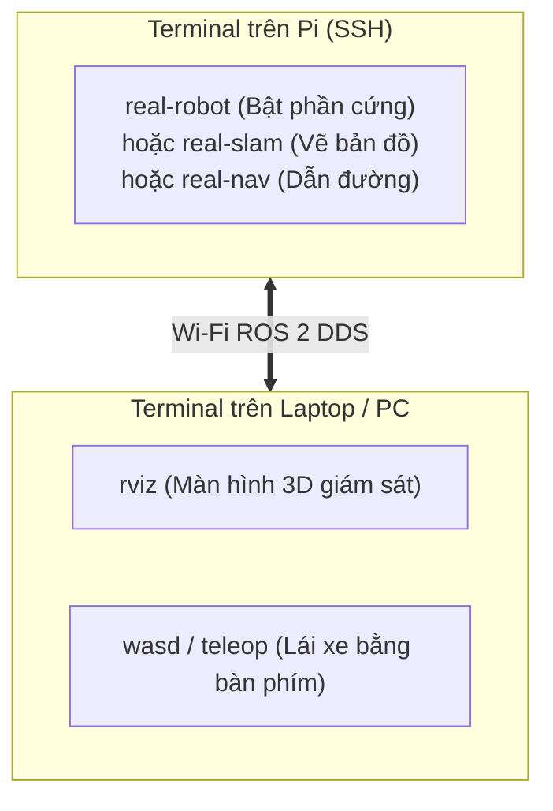

# 🚀 HƯỚNG DẪN VẬN HÀNH TOÀN DIỆN XE TỰ HÀNH TRÊN RASPBERRY PI (XE THẬT)

> **Tài liệu quy trình chuẩn từ khi vừa Clone code về Pi đến lúc xe lăn bánh ngoài thực tế**  
> *Hỗ trợ đầy đủ:* LiDAR, Camera Astra, ESP32 Encoders, IMU, GPS và AI CNN Bám luống.

---

## 📑 MỤC LỤC
1. [Giai Đoạn 1: Thiết Lập Môi Trường Trên Raspberry Pi (Làm 1 Lần)](#-giai-đoạn-1-thiết-lập-môi-trường-trên-raspberry-pi-làm-1-lần)
2. [Giai Đoạn 2: Cố Định Cổng USB (Udev Rules) Cho Cảm Biến](#-giai-đoạn-2-cố-định-cổng-usb-udev-rules-cho-cảm-biến)
3. [Giai Đoạn 3: Tích Hợp GPS & IMU Vào Hệ Thống (Sensor Fusion EKF)](#-giai-đoạn-3-tích-hợp-gps--imu-vào-hệ-thống-sensor-fusion-ekf)
4. [Giai Đoạn 4: Kiểm Tra Từng Bộ Phận Phần Cứng (Hardware Test)](#-giai-đoạn-4-kiểm-tra-từng-bộ-phận-phần-cứng-hardware-test)
5. [Giai Đoạn 5: Các Kịch Bản Vận Hành Xe Thật](#-giai-đoạn-5-các-kịch-bản-vận-hành-xe-thật)
6. [Bảng Tra Cứu Sự Cố Thường Gặp & Cách Khắc Phục (Troubleshooting)](#-bảng-tra-cứu-sự-cố-thường-gặp--cách-khắc-phục)

---

## 🛠️ GIAI ĐOẠN 1: THIẾT LẬP MÔI TRƯỜNG TRÊN RASPBERRY PI (LÀM 1 LẦN)

Sau khi vừa clone code về Raspberry Pi (ví dụ thư mục `~/robot-ws` hoặc `~/robot_ws`), mở Terminal trên Pi và thực hiện:

### 1. Cài đặt các gói phụ thuộc ROS 2 & Hệ thống:
```bash
sudo apt update
sudo apt install -y python3-pip python3-colcon-common-extensions \
    libuvc-dev libgoogle-glog-dev libgflags-dev libusb-1.0-0-dev \
    ros-jazzy-robot-localization ros-jazzy-slam-toolbox ros-jazzy-navigation2 \
    ros-jazzy-nav2-bringup ros-jazzy-tf2-ros ros-jazzy-joint-state-publisher \
    ros-jazzy-robot-state-publisher ros-jazzy-xacro ros-jazzy-teleop-twist-keyboard \
    ros-jazzy-nmea-msgs ros-jazzy-imu-tools
```

### 2. Cài đặt thư viện Python xử lý Serial, AI & Ảnh:
```bash
pip3 install pyserial numpy onnxruntime opencv-python --break-system-packages
```

### 3. Cấp quyền cổng Serial cho tài khoản Pi:
*(Giúp Pi tự động đọc/ghi cổng Serial USB mà không cần gõ `sudo chmod 666` mỗi lần cắm cáp)*
```bash
sudo usermod -a -G dialout $USER
newgrp dialout
```

### 4. Đăng ký bộ phím tắt thông minh (`aliases.sh`):
```bash
# Nếu thư mục là robot-ws:
echo "source '$HOME/robot-ws/aliases.sh'" >> ~/.bashrc
source ~/.bashrc
```

### 5. Cấu hình phần cứng trên Raspberry Pi 5 (Bắt buộc):
- **Mở khóa nguồn USB 1.6A (Tránh sụt áp/ngắt thiết bị khi cắm Camera + LiDAR + ESP32):**
  ```bash
  echo "usb_max_current_enable=1" | sudo tee -a /boot/firmware/config.txt
  ```
- **Bật cổng Serial GPIO cho GPS (`/dev/ttyAMA0`):**
  Chạy `sudo raspi-config` -> **Interface Options** -> **Serial Port**:
  - *Login shell over serial:* Chọn **NO**
  - *Serial port hardware enabled:* Chọn **YES**
  - Khởi động lại: `sudo reboot`

### 6. Biên dịch Workspace:
```bash
cd ~/robot-ws   # hoặc cd ~/robot_ws
build
```
> *(Lệnh `build` sẽ tự động chạy `colcon build --symlink-install` và nạp môi trường `install/setup.bash`).*

---

## 🔌 GIAI ĐOẠN 2: SƠ ĐỒ KẾT NỐI CỔNG & CỐ ĐỊNH USB (UDEV RULES)

### 1. Sơ đồ cắm cổng tối ưu trên Raspberry Pi 5:
* **Camera Astra Mini S:** Cắm vào **Cổng USB 3.0 (Màu xanh dương)** (Băng thông cao & nguồn ổn định).
* **LiDAR RPLIDAR C1:** Cắm vào **Cổng USB 3.0 (Màu xanh dương)**.
* **ESP32 Controller:** Cắm vào **Cổng USB 2.0 (Màu đen)** (`/dev/ttyUSB0` hoặc `/dev/ttyACM0`).
* **Module GPS (Dây nhảy GPIO):**
  - `VCC` $\to$ Chân 2 hoặc 4 (5V)
  - `GND` $\to$ Chân 6 (GND)
  - `TX (GPS)` $\to$ **Chân 10 (GPIO 15 / RXD)**
  - `RX (GPS)` $\to$ **Chân 8 (GPIO 14 / TXD)**
  - Cổng đọc: **`/dev/ttyAMA0`** (Tốc độ: **`38400 baud`**).
* **Module IMU ICM-20948 (Dây nhảy GPIO I2C):**
  - `VCC` $\to$ Chân 1 (3.3V), `GND` $\to$ Chân 6 (GND)
  - `SDA` $\to$ Chân 3 (GPIO 2), `SCL` $\to$ Chân 5 (GPIO 3)
  - `CS` $\to$ **Nối lên 3.3V** (Bắt buộc để chọn I2C), `AD0` $\to$ **Nối xuống GND** (Địa chỉ `0x68`).

### 2. Cố định cổng USB (Udev Rules):
1. Tạo file udev rule:
   ```bash
   sudo nano /etc/udev/rules.d/99-robot-serial.rules
   ```
2. Dán nội dung:
   ```bash
   # RPLIDAR C1 / A1
   SUBSYSTEM=="tty", ATTRS{idVendor}=="10c4", ATTRS{idProduct}=="ea60", MODE:="0666", SYMLINK+="rplidar"

   # ESP32 Motor Controller (CH343 / CH340 / CP2102)
   SUBSYSTEM=="tty", ATTRS{idVendor}=="1a86", ATTRS{idProduct}=="55d3", MODE:="0666", SYMLINK+="esp32"
   SUBSYSTEM=="tty", ATTRS{idVendor}=="1a86", ATTRS{idProduct}=="7523", MODE:="0666", SYMLINK+="esp32"
   ```
3. Áp dụng rule:
   ```bash
   sudo udevadm control --reload-rules && sudo udevadm trigger
   ```

---

## 🧭 GIAI ĐOẠN 3: TÍCH HỢP GPS & IMU VÀO HỆ THỐNG (SENSOR FUSION EKF)

### 1. Kiến trúc Cây Khung Toạ Độ Chuẩn (TF Tree - REP 105):
$$\text{map} \xrightarrow{\text{EKF Global (Có GPS)}} \text{odom} \xrightarrow{\text{EKF Local (Wheel + IMU)}} \text{base\_footprint} \xrightarrow{\text{URDF}} \text{base\_link} \rightarrow \{\text{imu\_link}, \text{gps\_link}, \text{laser\_frame}\}$$

### 2. Các Topic chuẩn trong ROS 2:
| Cảm biến | Topic ROS 2 | Loại tin nhắn (Message Type) | Cổng & Tốc độ |
| :--- | :--- | :--- | :--- |
| **Bánh xe (ESP32)** | `/wheel/odom` | `nav_msgs/msg/Odometry` | `/dev/esp32` @ 115200 |
| **IMU (ICM-20948)** | `/imu/data` | `sensor_msgs/msg/Imu` | I2C `0x68` (Pin 3, 5) |
| **GPS Module** | `/gps/fix` | `sensor_msgs/msg/NavSatFix` | `/dev/ttyAMA0` @ 38400 |
| **GPS Chuyển đổi** | `/odometry/gps` | `nav_msgs/msg/Odometry` | NavSat Transform |
| **Vị trí lọc EKF** | `/odometry/filtered` | `nav_msgs/msg/Odometry` | `odom` frame |

---

## 🔍 GIAI ĐOẠN 4: KIỂM TRA TỪNG BỘ PHẬN PHẦN CỨNG (HARDWARE TEST)

Trước khi cho xe chạy tổng thể, hãy kiểm tra từng module:

### 1. Kiểm tra ESP32 & Động cơ bánh xe:
```bash
ros2 run my_robot_bringup esp32_bridge --ros-args -p serial_port:=/dev/esp32
```
*(Kiểm tra log: Thấy `Connected to ESP32 on /dev/esp32 at 115200 baud` là thành công).*

### 2. Kiểm tra Mắt quét LiDAR RPLIDAR C1:
```bash
test-lidar
```
*(LiDAR quay tròn và xuất hiện chùm tia laser 360° trên RViz).*

### 3. Kiểm tra Camera Astra Mini S (Full 30 FPS Depth + Color):
```bash
test-cam
```
*Hoặc lệnh chi tiết:*
```bash
ros2 launch astra_camera astra.launch.xml \
    enable_color:=true enable_depth:=true \
    color_width:=640 color_height:=480 \
    depth_width:=640 depth_height:=480 \
    enable_point_cloud:=false
```
*(Kiểm tra: `ros2 topic hz /camera/color/image_raw` và `ros2 topic hz /camera/depth/image_raw` đều đạt ~30 FPS).*

### 4. Kiểm tra Định vị GPS:
- **Cách 1: Xem dữ liệu NMEA gốc từ cổng UART GPIO:**
  ```bash
  stty -F /dev/ttyAMA0 38400 raw -echo && cat /dev/ttyAMA0
  ```
  *(Màn hình in các câu `$GNGGA...`, `$GNRMC...` liên tục).*
- **Cách 2: Khởi chạy ROS 2 GPS Driver:**
  ```bash
  test-gps
  # hoặc:
  ros2 run my_robot_controller gps_driver --ros-args -p serial_port:=/dev/ttyAMA0 -p baudrate:=38400
  ```
  *(Mở tab mới kiểm tra tọa độ: `ros2 topic echo /gps/fix`).*

### 5. Kiểm tra Cảm biến IMU ICM-20948:
```bash
sudo i2cdetect -y 1
```
*(Thấy địa chỉ `68` xuất hiện trên bảng I2C).*

### 6. Kiểm tra tổng quát 1-Click:
```bash
test-all
```

---

## 🚗 GIAI ĐOẠN 5: CÁC KỊCH BẢN VẬN HÀNH XE THẬT

> **Mô hình kết nối:** Đặt Laptop và Raspberry Pi cùng bắt chung 1 mạng Wi-Fi (hoặc phát Wi-Fi từ điện thoại/Router).



---

### 🟢 KỊCH BẢN A: Lái thử bằng bàn phím WASD (Test độ ổn định)
1. **Trên Pi (SSH):** Khởi động phần cứng xe
   ```bash
   real-robot
   ```
2. **Trên Laptop:**
   - **Terminal 1:** Mở giao diện RViz 3D:
     ```bash
     rviz
     ```
   - **Terminal 2:** Mở bàn phím lái xe:
     ```bash
     wasd
     ```
     - Nhấn `W` / `S`: Tiến / Lùi.
     - Nhấn `A` / `D`: Rẽ Trái / Phải.
     - Nhấn `Space` / `X`: Phanh dừng khẩn cấp.

---

### 🗺️ KỊCH BẢN B: Quét và dựng bản đồ thực tế (SLAM Mapping)
1. **Trên Pi (SSH):** Bật SLAM quét bản đồ
   ```bash
   real-slam
   ```
2. **Trên Laptop:**
   - Mở `rviz` để quan sát bản đồ đang vẽ trực tiếp từ LiDAR.
   - Mở `wasd` lái xe chạy từ từ quanh phòng/vườn bắp để LiDAR lấp đầy các góc khuất.
3. **Lưu bản đồ khi vẽ xong:**
   - Trên Terminal gõ:
     ```bash
     savemap ban_do_vuon_bap
     ```
   *(Bản đồ `ban_do_vuon_bap.yaml` và `ban_do_vuon_bap.pgm` được lưu vào thư mục `maps/`).*

---

### 📍 KỊCH BẢN C: Tự hành thông minh Nav2 theo bản đồ đã lưu
1. **Trên Pi (SSH):**
   ```bash
   real-nav map:=/home/vinh/robot-ws/maps/ban_do_vuon_bap.yaml
   ```
2. **Trên Laptop:**
   - Mở `rviz`.
   - Dùng công cụ **2D Pose Estimate** trên thanh menu RViz chấm vào vị trí hiện tại của xe để khởi tạo vị trí ban đầu (AMCL Localization).
   - Nhấn phím **`G`** (hoặc nút **Nav2 Goal**), click chuột vào vị trí bất kỳ trên bản đồ $\to$ Xe sẽ tự động tính đường uốn lượn né chướng ngại vật và chạy đến đích.
   - Khi cần hủy: Gõ `cancel` trên terminal hoặc bấm **Cancel Nav** trên RViz.

---

### 🌽 KỊCH BẢN D: Tự lái bám hàng bắp bằng AI CNN & Quay đầu U-Turn
1. Đảm bảo file model ONNX đã có tại `models/crop_row_cnn_best_test.onnx`.
2. Đặt xe vào đầu luống bắp, hướng camera dọc theo rãnh giữa 2 hàng bắp.
3. **Trên Pi (SSH):** Chạy lệnh:
   ```bash
   ros2 launch my_robot_bringup real_robot.launch.py enable_camera:=true enable_cnn:=true
   ```
4. **Cơ chế hoạt động:**
   - Camera thu nhận hình ảnh $\to$ Mạng CNN phân đoạn luống bắp và tính tâm đường đi $\to$ Bộ điều khiển bám hàng PID lái xe chạy thẳng mượt mà.
   - Khi hết hàng bắp (LiDAR và Camera nhận diện vùng trống): Xe tự kích hoạt chu trình **Drive Out (2.5m)** $\to$ Tự động bẻ lái cung tròn **U-Turn 180°** sang hàng bắp tiếp theo.

---

## 🛠️ BẢNG TRA CỨU SỰ CỐ THƯỜNG GẶP & CÁCH KHẮC PHỤC

| Hiện tượng | Nguyên nhân | Cách khắc phục xử lý nhanh |
| :--- | :--- | :--- |
| **`Permission Denied /dev/ttyUSB*`** | Chưa cấp quyền người dùng vào nhóm cổng Serial. | Chạy `sudo usermod -a -G dialout $USER && newgrp dialout` hoặc `sudo chmod 666 /dev/ttyUSB*`. |
| **Không thấy topic giữa Pi và PC** | Khác mạng Wi-Fi hoặc lệch biến `ROS_DOMAIN_ID`. | Đảm bảo 2 máy kết nối chung Wi-Fi và đặt cùng `export ROS_DOMAIN_ID=0`. |
| **Bản đồ RViz bị giật/nhấp nháy** | Hai node cùng phát TF `odom -> base_footprint`. | Kiểm tra `esp32_bridge`: Đảm bảo đã đặt `publish_tf: false` khi sử dụng EKF. |
| **Xe không nhận lệnh `wasd`** | Chuột chưa click vào cửa sổ Terminal `wasd`. | Click chuột vào trong cửa sổ Terminal chạy `wasd` rồi mới bấm phím. |
| **GPS báo `NO_FIX`** | Ăng-ten GPS bị che khuất trong nhà. | Đưa xe/ăng-ten ra không gian thoáng ngoài trời 1-2 phút để bắt đủ $> 6$ vệ tinh. |
| **Động cơ quay ngược hướng** | Đấu nhầm dây motor hoặc đảo vế trái/phải. | Đổi lại chân dây tín hiệu PWM hoặc chỉnh dấu âm/dương trong `esp32_bridge.py`. |
